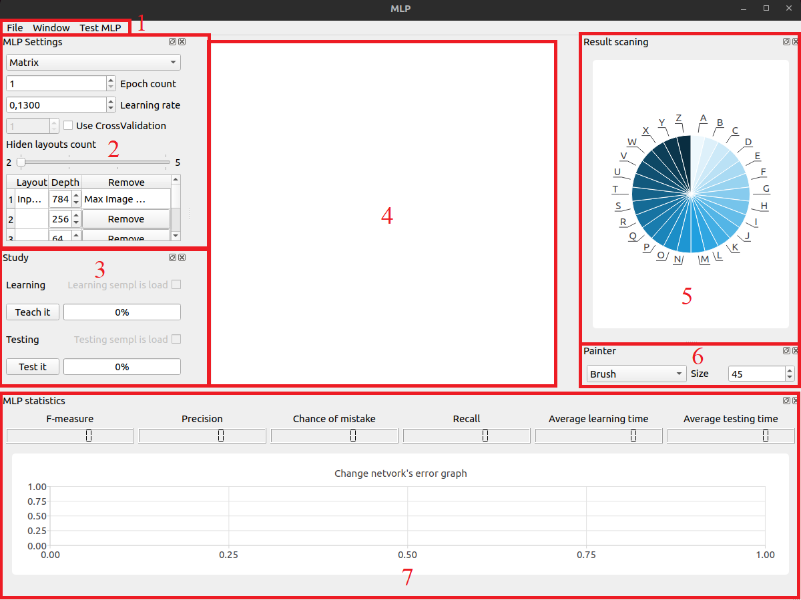
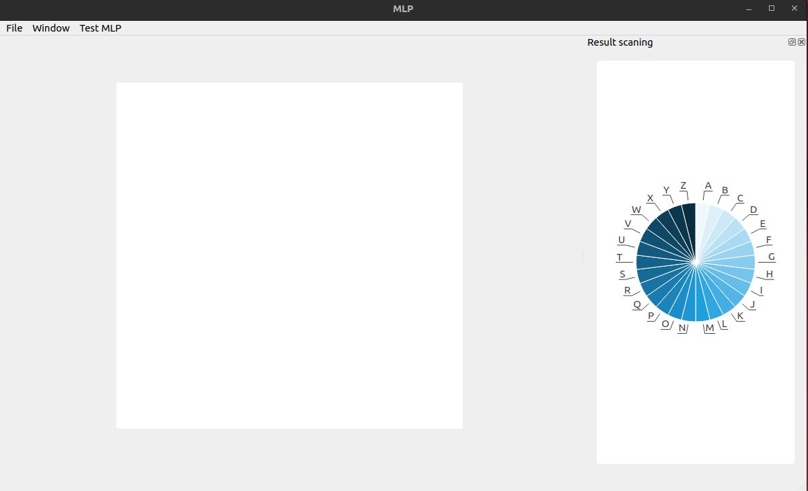
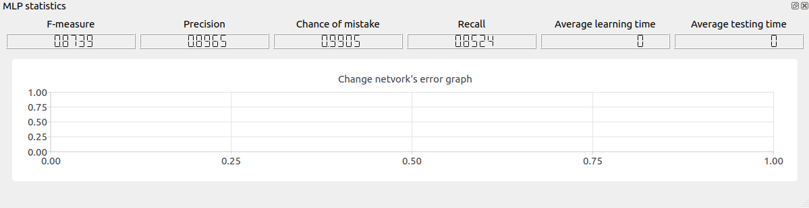
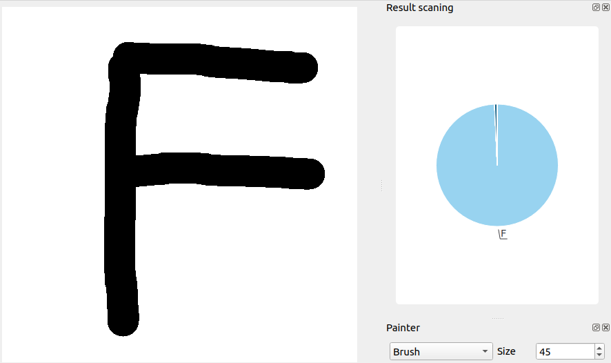
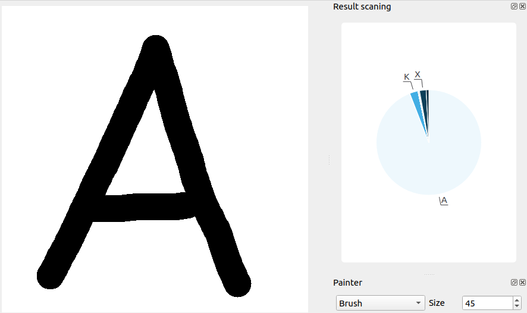
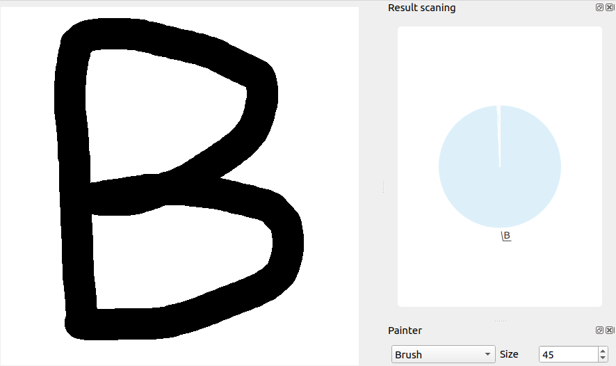
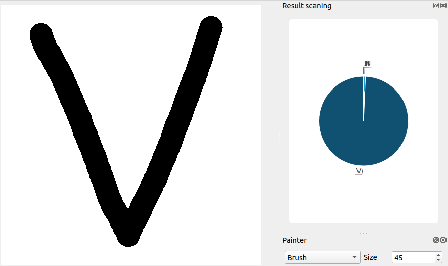
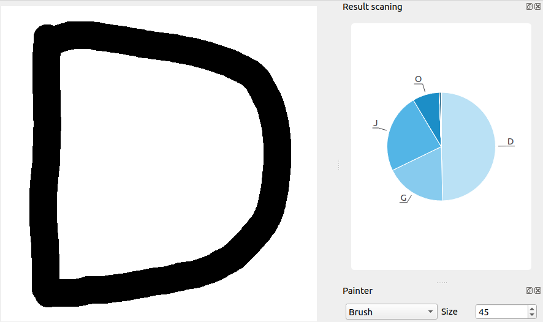

# MultilayerPerceptron Project

This project is an implementation of a multilayer perceptron in C++ language using C++17 standard. The perceptron is able to classify images with handwritten letters of the Latin alphabet and has from 2 to 5 hidden layers. The program is built using the MVC pattern and the GUI implementation is based on the Qt library.

## Table of Contents
- [Dependencies](#dependencies)
- [Build and Installation](#build-and-installation)
- [Usage](#usage)
- [License](#license)

## Dependencies

The following dependencies are required to build and run this project:
- C++17
- CMake
- Qt5 Widgets
- Qt5 Charts
- Google Test library

## Build and Installation

To build and install this project, please follow the instructions below:

1. Clone this repository to your local machine.
2. Open a terminal and navigate to the project directory.
3. Run `cmake -S . -B ./build` to generate the build files.
4. Run `cmake --build ./build` to build the project.
5. Run `./build/MLP` to launch the program.

If you want to uninstall the project, you can run `find ./ -name "build" -type d -exec rm -rf {} +`.

## Usage

### Running the Program

To run the program, please follow the instructions below:

1. Launch the program by running `./build/MLP`.
2. Click on the "Load Dataset" button to load the dataset.
3. Click on the "Train" button to train the perceptron.
4. Click on the "Test" button to test the perceptron.
5. Use the other buttons and input fields to customize the settings of the perceptron.

### Saving and Loading Weights

To save or load weights of the perceptron, please follow the instructions below:

1. Click on the "Save Weights" button to save the current weights of the perceptron to a file.
2. Click on the "Load Weights" button to load the weights of the perceptron from a file.

### Drawing Images

To draw images, please follow the instructions below:

1. Click on the "Draw Image" button to open the drawing window.
2. Draw an image by clicking and dragging the mouse.
3. Click on the "Classify" button to classify the drawn image.

### Real-Time Training

To start the real-time training process, please follow the instructions below:

1. Click on the "Real-Time Training" button to open the training window.
2. Input the number of epochs to train for and click on the "Start" button.
3. The error control values for each training epoch will be displayed in the graph.

### Cross-Validation

To run the training process using cross-validation, please follow the instructions below:

1. Click on the "Cross-Validation" button to open the cross-validation window.
2. Input the number of groups k to use and click on the "Start" button.
3. The average accuracy, precision, recall, f-measure, and total time spent on the experiment will be displayed on the screen.

## License

This project is licensed under the MIT License - see the [LICENSE](LICENSE) file for details.

<h1 align="center"> MLP </h1>
<h2 align="center"> Main window view </h2>

1. Basic application settings
2. Perceptron settings area
3. Perceptron learning control area
4. Manual image input area
5. Image processing result
6. Brush settings area for manual input zone
7. Trained network statistics

 All the above-mentioned entities can be manipulated in various ways (displayed over the display area, closed/opened, resized and relocated), for example, like this: 

<h2 align="center"> Basic settings </h2>
<h3><b> File tab: </b></h3>

1. Load network edge weights from file
2. Save network edge weights to file
3. Load image to manual input area for recognition

<h3><b> Window tab: </b></h3>

1. Display brush settings area
2. Display image processing result
3. Display Perceptron settings
4. Display trained network statistics

<h3><b> Test MLP tab: </b></h3>

1. Load data for network training
2. Load data for network testing

<h2 align="center"> Perceptron settings area </h2>

1. The ability to change the type of perceptron (matrix and graph)
2. Ability to change the number of training epochs
3. Ability to change the Learning Rate
4. Ability to use cross-validation
5. Change the number of hidden layers of the Perceptron (from 2 to 5) and their depth

 Note: the user cannot change the initial and final layers. 

<h2 align="center"> Perceptron learning control area </h2>

 In this program block, the user can observe the process of training and testing the network in real time. 

<h2 align="center"> Manual image input area </h2>

1. When the LMB is pressed, an image is created according to the mouse movements in the specified area.
2. When the RMB is pressed, the image is completely erased (the area is filled with white).

<h2 align="center"> Image processing result </h2>

 Displays a chart with the result of image processing from the manual input area, the result may be ambiguous, i.e. the network will find several matches and based on the chart you can see which option it leans towards more. 

<h2 align="center"> Brush settings area </h2>

1. Ability to choose brush mode:
2. Brush - paintbrush (draws)
3. Erase - eraser (erases)
4. Ability to choose brush width (from 1 to 100)

<h2 align="center"> Statistics of the Trained Network </h2>

<table align="center">
<tr> 
    <td>  </td>
</tr>
<tr>
    <td>
    Shows: <ul>
    <li>Average accuracy
    <li>Precision
    <li>Error rate
    <li>Recall
    <li>Training time
    <li>Testing time
    <li>Error plot
    </ul></td>
</tr>
</table>

<h2 align="center"> Research </h2>

<table align="center">
    <tr>
        <td></td>
        <td>10 runs</td>
        <td>100 runs</td>
        <td>1000 runs</td>
        <td>Average runtime per run</td>
    </tr>
    <tr>
        <td>Matrix Perceptron</td>
        <td>3510 sec</td>
        <td>35100 sec</td>
        <td>351000 sec</td>
        <td>351 sec</td>
    </tr>
    <tr>
        <td>Graph Perceptron</td>
        <td>5940 sec</td>
        <td>59400 sec</td>
        <td>594000 sec</td>
        <td>594 sec</td>
    </tr>
</table>

<h2 align="center"> Program Output Examples </h2>

